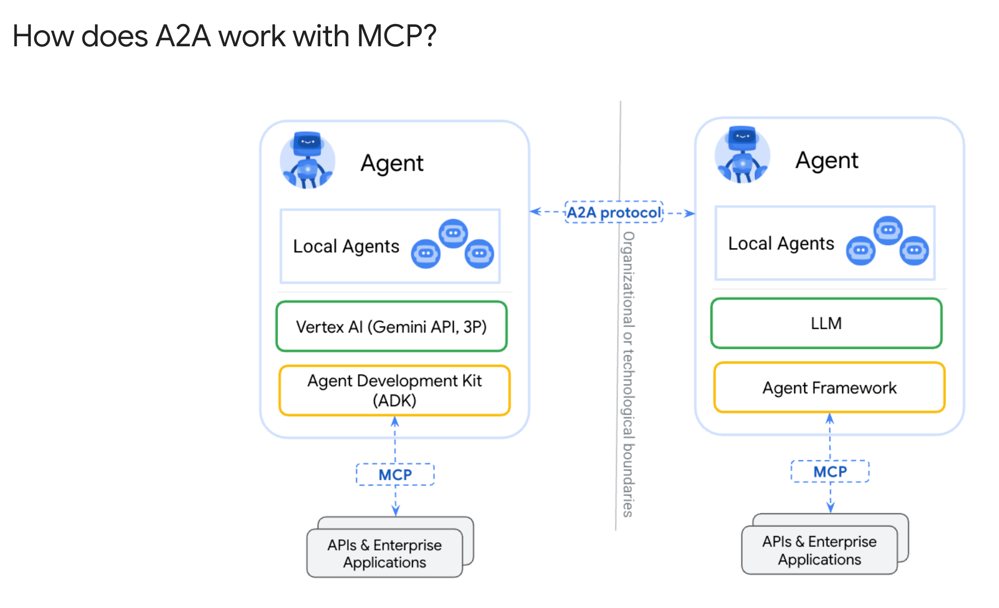
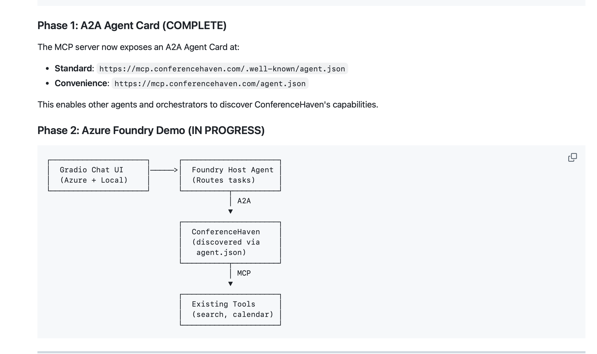

# Building ConferenceHaven: A Journey Through MCP and A2A

**Author**: Fabian Williams
**Date**: November 2025
**Project**: ConferenceHaven - AI-powered conference session discovery

---

## Get Involved

If at any point you have feedback, disagree with my positions, want to call me out, or eduate me... please start a discusison with me.. I (we) are all here hopefully to learn something new.. https://github.com/fabianwilliams/ConferenceHaven-Community/discussions

## The Vision

What if you could ask any AI assistant - Claude, ChatGPT, Copilot, or your local LLM - to find conference sessions for you? No searching through massive conference websites. No manually comparing schedules. Just ask.

That's ConferenceHaven.

**Live Today:**
- [conferencehaven.com/chat](https://conferencehaven.com/chat) - Web chat
- [mcp.conferencehaven.com/api/mcp](https://mcp.conferencehaven.com/api/mcp) - MCP integration for AI clients
- [a2a.conferencehaven.com](https://a2a.conferencehaven.com) - A2A demo with two collaborating LLMs

---

## The Art of the Possible

This document shares what I learned building ConferenceHaven - the wins, the challenges, and the opportunities I discovered. My hope is that sharing this journey helps others and contributes to making AI agent development more accessible.

### What We Built

```
┌─────────────────────────────────────────────────────────────────────────────┐
│                    ConferenceHaven - November 2025                          │
├─────────────────────────────────────────────────────────────────────────────┤
│                                                                             │
│  THREE WAYS TO ACCESS:                                                      │
│                                                                             │
│  1. WEB CHAT - Just open your browser                                       │
│     conferencehaven.com/chat                                                │
│                                                                             │
│  2. MCP TOOLS - Add to Claude Desktop, ChatGPT, LM Studio, Copilot Studio,  │
│     Agent Toolkit, URL: https://mcp.conferencehaven.com/api/mcp             │
│                                                                             │
│  3. A2A AGENTS - Two LLMs collaborating intelligently                       │
│     Demo: https://a2a.conferencehaven.com                                   │
│                                                                             │
│  DATA: 4 conferences, 2,060+ sessions                                       │
│  • Microsoft Ignite 2025 (1,545 sessions)                                   │
│  • Live360 Orlando 2025 (196 sessions)                                      │
│  • TechCon365 Dallas 2025 (174 sessions)                                    │
│  • ESPC25 Dublin 2025 (145 sessions)                                        │
│                                                                             │
└─────────────────────────────────────────────────────────────────────────────┘
```

---

## The Journey: From MCP to A2A

### Chapter 1: Starting with MCP

My first goal was simple: let any AI client search conference sessions via the **Model Context Protocol (MCP)**.

**What MCP Does Well:**
- Standardized way for AI clients to call tools
- Works with Claude Desktop, LM Studio, VS Code, Copilot Studio, Agent Toolkit, and more
- Clear tool definitions with JSON schemas

**The Challenge I Hit:**
The documentation focused on local (stdio) transport. I needed HTTP for remote access - no one wants to install a [local package](https://github.com/fabianwilliams/ConferenceHaven-Community/issues/1) just to search conferences.

**The Solution:**
I used FastMCP directly (not through Agent Framework) to create an HTTP endpoint:

```python
from mcp.server.fastmcp import FastMCP

mcp = FastMCP("conferencehaven", stateless_http=True)

@mcp.tool()
def search_sessions(query: str, conference: str = None):
    """Search conference sessions by topic, speaker, or keyword."""
    # ... implementation
```

**Result:** `https://mcp.conferencehaven.com/api/mcp` - works with any MCP-compatible client!

---

### Chapter 2: Understanding A2A - Complementary Protocols

After getting MCP working, I noodled a bit in my head and realized that there is another protocol designed specifically for the purpose I needed which is complimentary: **A2A (Agent-to-Agent)**.

According to the [A2A Protocol specification](https://a2a-protocol.org/latest/#how-does-a2a-work-with-mcp), these protocols are **complementary, not competing**:

> - **MCP (Model Context Protocol)**: Focuses on "agent-to-tool communication" - how agents connect to tools, APIs, and resources
> - **A2A Protocol**: Enables "agent-to-agent communication" - a universal standard allowing AI agents to collaborate across different frameworks


*Source: [A2A Protocol Documentation](https://a2a-protocol.org/latest/#how-does-a2a-work-with-mcp)*

**The Key Insight:**

In the diagram above, notice how each Agent has its own LLM and uses MCP to connect to its tools. The A2A protocol sits *between* agents, enabling them to delegate tasks across organizational or technological boundaries.

| Protocol | Purpose | When to Use |
|----------|---------|-------------|
| **MCP** | Agent-to-Tool | Connecting an agent to external tools and data sources |
| **A2A** | Agent-to-Agent | Orchestrating multiple agents that need to delegate tasks and coordinate |

**Why This Matters for ConferenceHaven:**

| Question | MCP Response | A2A Response |
|----------|--------------|--------------|
| "What is ESPC about?" | Tool doesn't know | Host Agent answers from knowledge |
| "Find AI sessions" | Returns raw data | Remote Agent searches, filters, formats intelligently |
| "AWS re:Invent sessions" | Error: not in database | Host Agent explains it's not supported yet |

With A2A, the **remote agent exercises judgment**. It can answer questions the tools can't handle because it has its own LLM making decisions.

---

### Chapter 3: Building A2A in Python

I wanted to implement A2A for ConferenceHaven. When I looked at the Microsoft Agent Framework documentation, I found this:



From the [Microsoft Learn documentation on A2A Integration](https://learn.microsoft.com/en-us/agent-framework/user-guide/hosting/agent-to-agent-integration):

> "This tutorial describes A2A integration in .NET apps; **Python integration is in the works.**"

The .NET implementation looked exactly like what I needed - `MapA2A()` for exposing agents over HTTP with agent card discovery. But I'm a Python developer building on FastAPI.

**Rather than wait, I built it myself** using the [A2A Protocol specification](https://a2a-protocol.org/latest/definitions/) as my guide.

**The Two-LLM Architecture:**

```
┌─────────────────────────────────────────────────────────────────────────────┐
│                         A2A: Two LLMs Collaborating                         │
├─────────────────────────────────────────────────────────────────────────────┤
│                                                                             │
│  ┌─────────────────────────┐         ┌─────────────────────────────────┐   │
│  │     HOST AGENT          │         │    CONFERENCEHAVEN AGENT        │   │
│  │   (Azure OpenAI)        │         │       (OpenAI)                  │   │
│  │                         │         │                                 │   │
│  │   "Should I delegate    │  A2A    │   "How should I search and     │   │
│  │    this question?"      │ ──────> │    format this response?"      │   │
│  │                         │         │                                 │   │
│  │   DECIDES: IF           │         │   DECIDES: HOW                 │   │
│  └─────────────────────────┘         └─────────────────────────────────┘   │
│                                                                             │
└─────────────────────────────────────────────────────────────────────────────┘
```

**What This Enables:**

The Host Agent at `a2a.conferencehaven.com` can:
- Answer general questions ("What is ESPC?") from its knowledge
- Delegate specific queries ("Find AI sessions") to ConferenceHaven
- Gracefully handle unsupported requests ("AWS re:Invent sessions")

**Try it yourself:** Visit [a2a.conferencehaven.com](https://a2a.conferencehaven.com)

---

## Key Learnings

### What Worked Beautifully

1. **FastMCP for HTTP endpoints** - Clean, simple, works with every MCP client
2. **Agent Card discovery** - `/.well-known/agent.json` is an elegant pattern for agent discovery
3. **Two LLMs > One LLM** - The Host Agent adds judgment that tools alone can't provide
4. **Multiple access patterns** - Different users need different entry points (web, MCP, A2A)

### Opportunities for the Ecosystem

These aren't complaints - they're opportunities I'd love to see the community address:

1. **A2A Python SDK** - I built A2A manually; an official SDK would make this easier for everyone
2. **MCP HTTP documentation** - More examples of remote MCP deployment would help
3. **Agent observability** - Production tracing for multi-agent systems is an emerging need

### What I'd Tell My Past Self

1. **Start with the user experience** - Web chat first, then expand to MCP and A2A
2. **Don't fight local-only tooling** - If something is designed for local dev, use proper production alternatives
3. **Two protocols are better than one** - MCP for tools, A2A for agents - they complement each other
4. **Build the demo** - Nothing clarifies thinking like a working implementation

---

## The Technical Stack

For those interested in the implementation:

| Component | Technology | Purpose |
|-----------|------------|---------|
| MCP Server | FastMCP + FastAPI | Tool access for AI clients |
| Web Chat | Microsoft Agent Framework | Browser-based chat |
| A2A Server | Custom Python + FastAPI | Agent-to-agent protocol |
| Host Agent | Azure OpenAI + Gradio | A2A demo interface |
| Database | Azure SQL | Session storage |
| Analytics | FastAPI + React + Auth0 | Usage insights |
| Observability | OpenTelemetry + Aspire | Production monitoring |

---

## Try It Yourself

### Easiest: Web Chat
Just visit [conferencehaven.com/chat](https://conferencehaven.com/chat)

### For AI Power Users: MCP Integration
Add to your AI client's MCP settings:
```json
{
  "mcpServers": {
    "conferencehaven": {
      "url": "https://mcp.conferencehaven.com/api/mcp"
    }
  }
}
```

### For Developers: A2A Integration
Discover the agent:
```bash
curl https://agent-chat.agreeablehill-3054e8bb.eastus2.azurecontainerapps.io/.well-known/agent.json
```

Send a message:
```bash
curl -X POST https://agent-chat.agreeablehill-3054e8bb.eastus2.azurecontainerapps.io/a2a/message:send \
  -H "Content-Type: application/json" \
  -d '{
    "message": {
      "message_id": "test-1",
      "role": "user",
      "parts": [{"kind": "text", "text": "Find AI sessions at ESPC"}]
    }
  }'
```

---

## What's Next

The AI agent ecosystem is evolving rapidly. Here's what I'm excited about:

- **More conferences** - Expanding to additional tech conferences
- **Smarter recommendations** - Using session history to suggest relevant talks
- **Deeper A2A integration** - Multi-agent workflows for conference planning
- **Community contributions** - Your feedback shapes the roadmap!

---

## Get Involved

- **Try it**: [conferencehaven.com/chat](https://conferencehaven.com/chat)
- **Integrate it**: Add the MCP server to your AI workflow
- **Give feedback**: [Open an issue](https://github.com/fabianwilliams/ConferenceHaven-Community/issues)
- **Connect**: [conferencehaven@adotob.com](mailto:conferencehaven@adotob.com)

---

## References

These resources shaped my understanding and implementation:

### Protocol Specifications
- [A2A Protocol Specification](https://a2a-protocol.org/latest/) - The official A2A standard
- [How A2A Works with MCP](https://a2a-protocol.org/latest/#how-does-a2a-work-with-mcp) - Complementary protocols explained
- [Model Context Protocol](https://modelcontextprotocol.io/) - MCP specification

### Microsoft Agent Framework
- [A2A Integration Guide (.NET)](https://learn.microsoft.com/en-us/agent-framework/user-guide/hosting/agent-to-agent-integration) - Where I learned Python support was "in the works"
- [Can You Build Agent2Agent on MCP?](https://developer.microsoft.com/blog/can-you-build-agent2agent-communication-on-mcp-yes) - Great framing of the challenges

### Our Implementation
- [ConferenceHaven A2A Demo](https://a2a.conferencehaven.com) - Try the two-LLM collaboration
- [A2A Integration Guide](./docs/A2A-GUIDE.md) - Technical details for developers

---

## Acknowledgments

This project stands on the shoulders of giants:

- **Microsoft Agent Framework** team - For ChatAgent and the vision
- **Anthropic** - For MCP and Claude
- **Google** - For the A2A protocol specification
- **The conference organizers** - For making session data available
- **The community** - For feedback and encouragement

---

**Building the future of conference discovery, one agent at a time.**

*Fabian Williams*
*November 2025*
