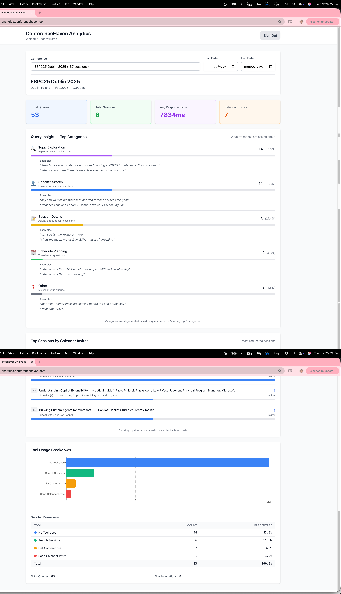

# ConferenceHaven Community

Welcome to the **ConferenceHaven Community** repository! 👋

This is the public home for feedback, documentation, and discussions about ConferenceHaven - your AI-powered conference assistant.

**Website**: [conferencehaven.com](https://conferencehaven.com)
**Web Chat**: [conferencehaven.com/chat](https://conferencehaven.com/chat)
**MCP Endpoint**: `https://mcp.conferencehaven.com/api/mcp`

---

## What is ConferenceHaven?

**Discover conference sessions with AI** - Search thousands of technical sessions across major conferences using your favorite AI assistant. Works in your browser, with AI desktop clients, and supports agent-to-agent (A2A) integration.

### 🌟 Why ConferenceHaven?

- 🔍 **Smart Search** - Natural language search across Microsoft Ignite, Live360, ESPC, and more
- 📅 **Calendar Integration** - Add sessions directly to your calendar with a single request
- 🌐 **Multiple Ways to Connect** - Web chat, AI desktop clients (Claude, ChatGPT, LM Studio), or A2A integration
- 🚀 **Zero Friction** - Web chat requires no installation or authentication
- 🤖 **A2A Ready** - Conference organizers can integrate via agent-to-agent protocols
- 🔒 **Privacy Options** - Use local models (LM Studio, Ollama) for complete privacy

### 🎯 Supported Conferences

- **TechCon365 Dallas 2025** - Nov 3-7, 2025 (174+ sessions loaded)
- **Microsoft Ignite 2025** - Nov 18-21, 2025 (coming soon)
- **Live360 Orlando 2025** - Nov 16-21, 2025 (coming soon)
- **ESPC25 Dublin** - Dec 1-4, 2025 (coming soon)
- More conferences added regularly!

---

## 🚀 Quick Start - Choose Your Path

### Path 1: Web Chat (Easiest - No Installation!)

**Best for**: Everyone who wants instant access

👉 **Just visit: [conferencehaven.com/chat](https://conferencehaven.com/chat)**

No downloads. No setup. No authentication. Just open your browser and start asking:

```
You: "Show me AI sessions at TechCon365"
Agent: [Returns sessions with speakers, times, locations]

You: "Send me a calendar invite for session 957 to email@example.com"
Agent: ✅ Calendar invite sent! Check your email.
```

**Why web chat?**
- ✅ Works on any device (desktop, mobile, tablet)
- ✅ HTTPS trusted by all browsers (no security warnings)
- ✅ Accessible at conferences on your phone
- ✅ Zero setup - instant gratification

---

### Path 2: AI Desktop Clients (MCP Integration)

**Best for**: Power users who want ConferenceHaven integrated into their AI workflow

ConferenceHaven implements the **Model Context Protocol (MCP)**, which means it works as a tool inside your favorite AI assistant:

```
User: "Find Copilot sessions at Microsoft Ignite"
  ↓
AI Agent (Claude Desktop, ChatGPT, LM Studio, etc.)
  ↓
ConferenceHaven MCP Tool
  ↓
Natural Language Response with Sessions
```

#### Supported AI Clients

| Client | Best For | Setup Time | Privacy |
|--------|----------|------------|---------|
| **Claude Desktop** | Power users | 5 min | Cloud |
| **LM Studio** | Privacy-focused | 5 min | Local (100% private) |
| **ChatGPT** | Plus/Pro users | 2 min | Cloud |
| **Copilot Studio** | Enterprise | 2 min | Cloud |
| **GitHub Copilot** | Developers | 5 min | Cloud |

#### Quick Setup Options

**Simple URL-Based Setup**

Modern AI clients support **direct HTTP MCP connections** - no packages, no Node.js, no downloads:

| Platform | Plan Required | Status | Setup |
|----------|--------------|--------|-------|
| **Claude Desktop** | Any (Free/Pro) | ✅ Stable | Add `https://mcp.conferencehaven.com/api/mcp` in MCP settings |
| **ChatGPT** | Plus/Pro ($20/mo) | ✅ Stable | Add `https://mcp.conferencehaven.com/api/mcp` in Apps & Connectors |
| **LM Studio** | Free | ✅ Stable | Add `https://mcp.conferencehaven.com/api/mcp` in MCP settings |
| **Copilot Studio** | Microsoft 365 | ✅ Stable | Add `https://mcp.conferencehaven.com/api/mcp` as MCP connector |

✨ **Why this is better**: Direct HTTP connections are faster, simpler, and work across all platforms!

[Jump to detailed setup instructions ↓](#detailed-setup-instructions)

---

### Path 3: Agent-to-Agent (A2A) Integration

**Best for**: Conference organizers and developers building multi-agent systems

ConferenceHaven supports the **A2A (Agent-to-Agent) protocol** - an open standard for agent interoperability. Your AI agents can discover and collaborate with ConferenceHaven as a specialized conference session expert.

**Discover ConferenceHaven's capabilities:**
```bash
curl https://mcp.conferencehaven.com/.well-known/agent.json
```

**A2A Agent Card** tells your system:
- What ConferenceHaven can do (search, calendar invites, etc.)
- How to communicate (MCP endpoint)
- What authentication is needed (none for public tools)

**Example A2A flow**:
```
User: "Find AI sessions at ESPC and add the best one to my calendar"
     ↓
Your Host Agent (Orchestrator)
     ↓ discovers ConferenceHaven via agent card
     ↓ delegates conference tasks
     ↓
ConferenceHaven Agent
     ↓ search_sessions("AI", conference="espc")
     ↓ send_calendar_invite(session_id, email)
     ↓
Response back to user
```

**Why A2A?**
- ✅ Standard protocol (Google, Microsoft, 50+ partners)
- ✅ Agents specialize (ConferenceHaven = conference expert)
- ✅ Works with any A2A-compatible orchestrator
- ✅ Built on MCP for tool execution

📖 **[Full A2A Integration Guide →](./docs/A2A-GUIDE.md)**

**Interested in A2A integration?** Email: **conferencehaven@adotob.com**

---

## 📚 Documentation

- [Setup Guides](./docs/SETUP-GUIDES.md) - How to configure ConferenceHaven with different AI clients
- [A2A Integration Guide](./docs/A2A-GUIDE.md) - Agent-to-Agent protocol integration
- [FAQ](./docs/FAQ.md) - Frequently asked questions
- [Troubleshooting](./docs/TROUBLESHOOTING.md) - Common issues and solutions
- [Architecture Overview](./docs/ARCHITECTURE.md) - High-level technical overview

---

## Detailed Setup Instructions

Choose your AI client and get started:

### Option 1: Microsoft Copilot Studio (Browser-based)

**Best for**: Enterprise users with Microsoft 365

1. Open [Copilot Studio](https://copilotstudio.microsoft.com/)
2. Navigate to: **Actions** → **Add an action** → **Add MCP Connector**
3. Enter URL: `https://mcp.conferencehaven.com/api/mcp`
4. Save and start asking: *"List all conferences"*

[View detailed Copilot Studio setup guide →](docs/SETUP-GUIDES.md#-copilot-studio)

### Option 2: Claude Desktop

**Best for**: Power users who want full MCP integration

1. Open Claude Desktop Settings
2. Navigate to: **Developer** → **Edit Config**
3. Add the MCP server URL:
```json
{
  "mcpServers": {
    "conferencehaven": {
      "url": "https://mcp.conferencehaven.com/api/mcp"
    }
  }
}
```
4. Restart Claude Desktop
5. Look for 🔌 icon and ask: *"What conferences are available?"*

[View detailed Claude Desktop setup guide →](docs/SETUP-GUIDES.md#-claude-desktop)

### Option 3: LM Studio (Local & Private)

**Best for**: Privacy-focused users who want local AI models

1. Download [LM Studio](https://lmstudio.ai)
2. Download a model with function calling support (Llama 3.2, Mistral, Qwen)
3. Settings → MCP Servers → Add Server:
```json
{
  "mcpServers": {
    "conferencehaven": {
      "url": "https://mcp.conferencehaven.com/api/mcp"
    }
  }
}
```
4. Start chat and try: *"Find sessions about AI"*

🛡️ **Complete Privacy**: Your searches never leave your computer—no cloud providers, no tracking!

[View detailed LM Studio setup guide →](docs/SETUP-GUIDES.md#-lm-studio-local-ai)

### Also Works With:

- **ChatGPT** - Via GPT Actions
- **GitHub Copilot** - VS Code integration
- **Ollama** - Local model runtime
- Any MCP-compatible client

[See all setup guides →](docs/SETUP-GUIDES.md)

---

## 💬 Providing Feedback

We welcome all feedback! Here's how to contribute:

### 🐛 Bug Reports
Found a bug? [Create a bug report](https://github.com/fabianwilliams/ConferenceHaven-Community/issues/new?template=bug_report.md)

### ✨ Feature Requests
Have an idea for a new feature? [Submit a feature request](https://github.com/fabianwilliams/ConferenceHaven-Community/issues/new?template=feature_request.md)

### 🎤 Conference Requests
Want to add your conference to ConferenceHaven? [Request a conference](https://github.com/fabianwilliams/ConferenceHaven-Community/issues/new?template=conference_request.md)

### 💭 General Feedback
Just want to share thoughts? [Open a general feedback issue](https://github.com/fabianwilliams/ConferenceHaven-Community/issues/new?template=general_feedback.md)

### 📧 No GitHub Account?
No problem! Email feedback to: **conferencehaven@adotob.com**

---

## 🤝 Contributing

We appreciate contributions from the community! Here's how you can help:

### Documentation
- Improve existing guides
- Add tutorials
- Translate documentation

### Feedback
- Report bugs you encounter
- Suggest features that would help you
- Share your use cases

### Spread the Word
- Share ConferenceHaven with your network
- Write blog posts or tweets about your experience
- Present at user groups or conferences

---

## 📊 Roadmap

Check out our [public roadmap](https://github.com/fabianwilliams/ConferenceHaven-Community/issues?q=is%3Aissue+is%3Aopen+label%3Aroadmap) to see what's coming next!

**Current Focus:**
- ✅ Web chat interface (LIVE!)
- ✅ Analytics dashboard with full observability (LIVE!)
- ✅ A2A Agent Card - ConferenceHaven discoverable via `/.well-known/agent.json` (LIVE!)
- ✅ A2A Integration Guide - Documentation for agent developers (LIVE!)
- ✅ A2A Foundry Demo - Two-LLM Host Agent at https://a2a.conferencehaven.com (LIVE!)
- 🔄 More conference integrations (Ignite, ESPC, Live360)
- 📋 Session recommendations based on interests
- 📋 Speaker profiles across conferences
- 📋 Embeddable widget for conference websites

---

## 📊 Analytics & Insights (November 2025)

ConferenceHaven now features a comprehensive analytics dashboard providing real-time insights into how attendees discover and engage with conference sessions.



**What We Track:**

- **Query Patterns**: AI-categorized analysis of attendee questions (Topic Exploration, Speaker Search, Session Details, Schedule Planning)
- **Tool Usage**: Complete tracking of all interactions - search sessions, calendar invites, conference listings
- **Session Popularity**: Most requested sessions by calendar invite requests
- **Performance Metrics**: Average response times and system health
- **Real-Time Stats**: Live updates of total queries, sessions, and calendar invites

**Why This Matters:**

For **conference organizers**, the analytics dashboard reveals:
- Which session topics generate the most interest
- Popular speakers and tracks
- Optimal times for sessions based on search patterns
- Calendar invite conversion rates

For **the community**, this demonstrates:
- Full transparency into system usage
- OpenTelemetry-based observability standards
- Privacy-conscious analytics (no PII tracked)
- Open data approach to conference engagement

**Technical Stack:**
- FastAPI + SQLAlchemy for backend analytics engine
- React + Recharts for dashboard visualizations
- Auth0 for secure organizer access
- OpenTelemetry for distributed tracing
- Azure SQL Database for analytics storage

**Latest Updates (Nov 25, 2025):**
- ✅ Calendar invite tracking fully operational
- ✅ Complete tool usage breakdown with all agent interactions
- ✅ Real-time query categorization using AI
- ✅ Multi-conference analytics support

Visit **[analytics.conferencehaven.com](https://analytics.conferencehaven.com)** to see live metrics!

---

## ❓ Support

Need help?
1. Check the [FAQ](./docs/FAQ.md)
2. Review [Troubleshooting](./docs/TROUBLESHOOTING.md)
3. [Open an issue](https://github.com/fabianwilliams/ConferenceHaven-Community/issues/new)
4. Email: **conferencehaven@adotob.com**

---

## 📜 License

ConferenceHaven is free to use. This community repository is for feedback and documentation.

---

## 🙏 Acknowledgments

Built with ❤️ by [Fabian Williams](https://github.com/fabianwilliams) and powered by:
- **Microsoft Agent Framework** - Agent orchestration
- **Model Context Protocol (MCP)** - Standardized agent-tool communication
- **OpenTelemetry** - Observability and tracing
- **Azure** - Cloud infrastructure
- The amazing tech conference community

---

**Let's make conference discovery accessible to everyone - whether you're using a browser, desktop AI client, or building agent-to-agent systems!** 🚀
