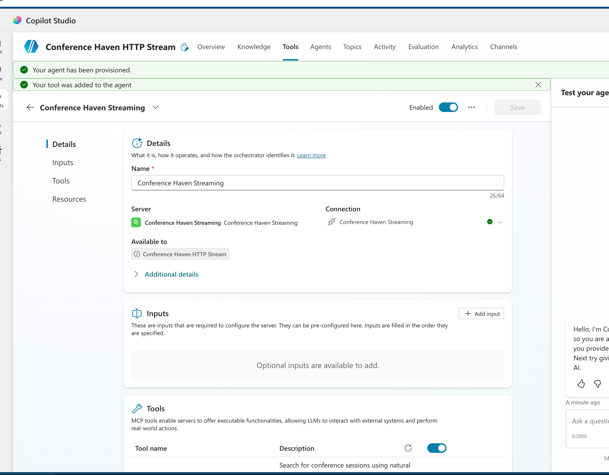
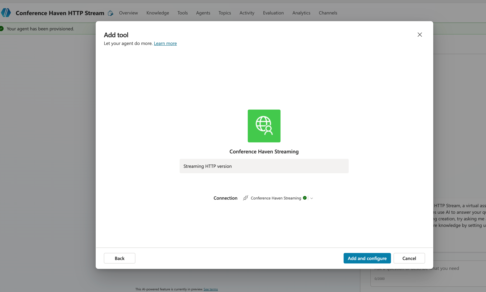
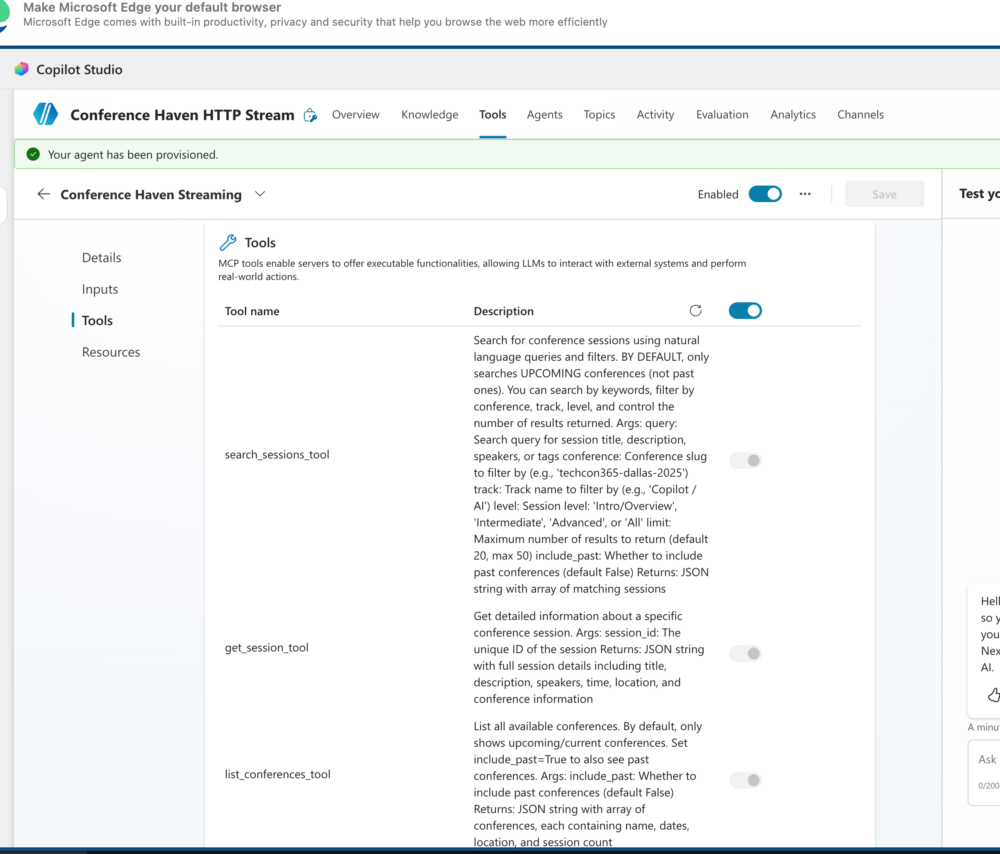

# Setup ConferenceHaven for Microsoft Copilot Studio

**Platform:** Web-based (copilot.microsoft.com)
**Requirements:** Microsoft account, Copilot Studio access
**Setup time:** ~2 minutes
**No downloads required!** ✅

Microsoft Copilot Studio now supports **Model Context Protocol (MCP)** servers natively! Connect ConferenceHaven using a simple URL—no coding, no command-line tools, no Node.js needed.

---

## Prerequisites

### 1. Microsoft Account

You need a Microsoft account (work, school, or personal) to use Copilot Studio.

- **Sign up:** [microsoft.com/account](https://microsoft.com/account)

### 2. Copilot Studio Access

Copilot Studio is available with:
- **Microsoft 365 Business** (includes Copilot Studio)
- **Power Platform** trial or license
- **Free trial:** [copilot.microsoft.com](https://copilot.microsoft.com)

---

## Installation Steps

### Step 1: Open Copilot Studio

1. Go to **[copilotstudio.microsoft.com](https://copilotstudio.microsoft.com)**
2. Sign in with your Microsoft account
3. Select or create an **Agent** (copilot)

### Step 2: Add MCP Server

1. In your agent settings, navigate to **Integrations** or **Connectors**
2. Look for **Model Context Protocol** or **MCP Server** option
3. Click **Add MCP Server**



### Step 3: Enter ConferenceHaven MCP URL

In the MCP Server URL field, paste:

```
https://mcp.conferencehaven.com/api/mcp
```

Click **Connect** or **Test Connection**



### Step 4: Verify Tools are Available

Copilot Studio will automatically discover and list all ConferenceHaven tools:

- ✅ **list_conferences** - Find conferences by name, date, or organizer
- ✅ **search_sessions** - Find sessions by topic, speaker, or track
- ✅ **get_session** - Get detailed session information
- ✅ **send_calendar_invite** - Add sessions to Outlook calendar



**Click "Save" or "Enable"** to activate these tools in your agent.

### Step 5: Test Your Agent

Click **Test** in the top-right corner and try asking:

```
"What conferences are available?"
"Find sessions about Azure AI at Microsoft Ignite"
"Show me Fabian Williams' speaking schedule"
```

Your agent will automatically use ConferenceHaven MCP tools to search and respond!

---

## Using ConferenceHaven in Your Agent

Once configured, users can ask your agent:

### Conference Search Examples
```
"What conferences are happening in 2025?"
"Find Microsoft conferences"
"Show me SharePoint conferences"
```

### Session Search Examples
```
"Find sessions about Azure AI"
"Show me keynote sessions at Ignite"
"What sessions cover Power Platform?"
```

### Session Details Examples
```
"Tell me about session 957"
"Get details for the keynote"
"What room is the Azure session in?"
```

### Calendar Invite Examples
```
"Send me a calendar invite for session 957 to my email"
"Add the keynote to my calendar"
```

---

## Customizing Your Agent

### Add Instructions

In Copilot Studio, add instructions to guide how your agent uses ConferenceHaven:

**Example instructions:**
```
You are a helpful conference assistant. When users ask about tech conferences,
sessions, or speakers, use ConferenceHaven MCP tools to search and provide results.
Always include session details like time, track, and room when available.
```

### Create Topics

Create specific topics for common requests:

**Topic: "Find Conference"**
- Trigger phrases: "find conference", "search event", "what conferences"
- Actions: Call `list_conferences` tool
- Response: Display conference name, dates, and location

**Topic: "Session Details"**
- Trigger phrases: "session details", "tell me about", "session info"
- Actions: Call `get_session` tool
- Response: Display session title, speaker, time, track

---

## Troubleshooting

### MCP Server Connection Failed

**Check 1: Verify URL**
Make sure you entered the exact URL:
```
https://mcp.conferencehaven.com/api/mcp
```

**Check 2: Check network connection**
- Make sure you can access mcp.conferencehaven.com in your browser
- Corporate firewalls may block external MCP servers
- Try: `curl https://mcp.conferencehaven.com/health` to verify server is reachable

**Check 3: Try again later**
- Temporary network issues may prevent connection
- Wait a few minutes and retry

### Tools Not Working

**Check 1: Tools are enabled**
- Go to your agent's MCP integrations
- Make sure ConferenceHaven MCP server is connected and tools are enabled

**Check 2: Test with simple queries**
Try basic searches first:
- `"What conferences are available?"`
- `"Find sessions at ESPC 2025"`

**Check 3: Check Copilot Studio logs**
- Click **Analytics** → **Conversations**
- Review conversation logs for error messages

### No Results Returned

ConferenceHaven is working! The database might not have the conference you're searching for yet.

**Try these test searches:**
- `"List all conferences"`
- `"Find sessions at Microsoft Ignite 2024"`

**Want to add a conference?** [Request it here](https://github.com/fabianwilliams/ConferenceHaven-Community/issues/new?template=conference-request.md)

### Calendar Invites Not Sending

Calendar invites require:
1. **Valid email address** provided in the request
2. **Azure AD authentication** configured on ConferenceHaven server
3. **Microsoft Graph API** permissions

Note: Calendar service is configured on the server side. If invites aren't working, it may be a server configuration issue.

---

## Publishing Your Agent

Once you're happy with your agent:

1. Click **Publish** in the top-right
2. Choose where to publish:
   - **Web widget** - Embed on your website
   - **Teams** - Add to Microsoft Teams
   - **Power Apps** - Integrate with Power Apps
   - **Mobile app** - Via Power Apps mobile

3. Share the link with your team!

---

## Updating ConferenceHaven

ConferenceHaven updates automatically—no action needed! When new conferences or features are added, they're immediately available through the MCP server.

**To manually refresh:**
1. Go to your agent's **Integrations** → **MCP Servers**
2. Find **ConferenceHaven**
3. Click **Reconnect** or **Test Connection**
4. This will verify the latest tools are available

---

## Removing ConferenceHaven

1. In your agent, go to **Integrations** → **MCP Servers**
2. Find **ConferenceHaven** in the list
3. Click **...** (three dots) → **Remove** or **Disconnect**
4. Confirm removal

---

## Why MCP is Better Than Swagger

The new MCP server approach offers several advantages over the old Swagger/REST API import:

✅ **Automatic tool discovery** - No manual API configuration needed
✅ **Real-time updates** - New tools appear automatically when server updates
✅ **Better error handling** - MCP provides richer error messages
✅ **Standardized protocol** - Works the same across all AI platforms
✅ **Simpler setup** - Just one URL instead of importing API specs

---

## Next Steps

- **[Architecture Overview](../ARCHITECTURE.md)** - How ConferenceHaven works
- **[FAQ](../FAQ.md)** - Common questions

---

## Need Help?

- **GitHub Issues:** [ConferenceHaven-Community/issues](https://github.com/fabianwilliams/ConferenceHaven-Community/issues)
- **Documentation:** [Full docs](../../README.md)

---

**Quick Links:**
- [← Back to Setup Guides](../SETUP-GUIDES.md)
- [Claude Desktop Setup Guide](CLAUDE-DESKTOP.md)
- [ChatGPT Setup Guide](CHATGPT.md)
- [LM Studio Setup Guide](LM-STUDIO.md)

---

## Why Copilot Studio + MCP

Microsoft Copilot Studio with MCP support provides:

✅ **No downloads required** - Everything is web-based
✅ **No command-line tools** - Just point and click
✅ **Enterprise-ready** - Built for business use cases
✅ **Easy to share** - Publish to Teams, web, or mobile
✅ **Native MCP support** - Uses the same protocol as Claude, ChatGPT, and others

Perfect for organizations that want AI-powered conference search with zero infrastructure!
